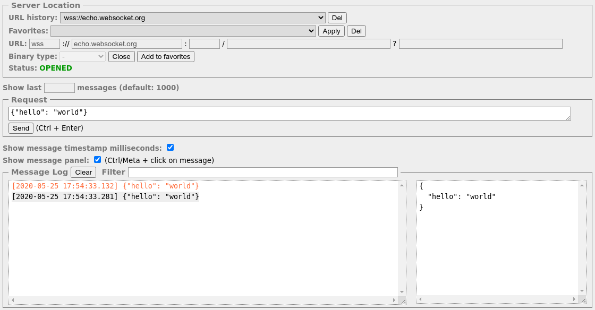

Simple-WebSocket-Client
=======================

[![License: MIT][1]][2] ![GitHub release][3] ![Chrome Web Store][4] ![Node.js CI][5]

Simple WebSocket Client is an extension for Google Chrome to help construct custom Web Socket requests and handle responses to directly test your Web Socket services.

Extension URL
-------------

https://chrome.google.com/webstore/detail/simple-websocket-client/gobngblklhkgmjhbpbdlkglbhhlafjnh

Contributors
------------

- Kazuyuki Honda ([hakobera](https://github.com/hakobera))
- Dmitriy Olshevskiy ([olshevskiy87](https://github.com/olshevskiy87))
- Maksim Karelov ([Ty3uK](https://github.com/Ty3uK))

License
-------

This software is released under the MIT License, see LICENSE.txt.

[1]: https://img.shields.io/badge/License-MIT-yellow.svg
[2]: https://opensource.org/licenses/MIT
[3]: https://img.shields.io/github/release/olshevskiy87/simple-websocket-client.svg
[4]: https://img.shields.io/chrome-web-store/rating/gobngblklhkgmjhbpbdlkglbhhlafjnh.svg
[5]: https://github.com/olshevskiy87/simple-websocket-client/workflows/Node.js%20CI/badge.svg
